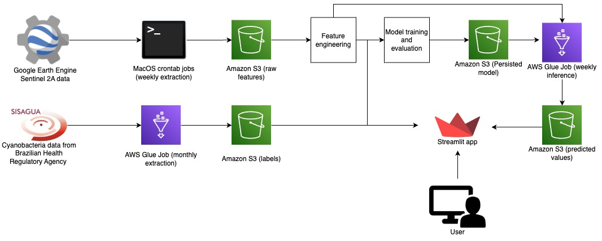

# Guaíba Lake Cyanobacteria Monitoring: A Data-Driven Approach


## Overview

This project, undertaken during mentorship at [Alforriah](https://www.alforriah.com/), focuses on leveraging data science techniques to monitor cyanobacteria in [Lake Guaíba](https://en.wikipedia.org/wiki/Gua%C3%ADba_(water_body)), considering its significant implications for both health and the economy.

## Project description

### Problem
Cyanobacteria, commonly known as "blue-green algae," can excessively proliferate in reservoirs and water bodies, especially those with a stagnant water regime, in a phenomenon known as algal blooms. These events can result in negative economic and health impacts<sup>[1](#references)</sup>. With global warming, an increase in the frequency and intensity of these events is expected<sup>[2](#references)</sup>. The increase in water quality monitoring data has the potential to assist the public and decision-makers in understanding the state of water resources in the face of this problem.

### Proposal
The goal of this project is to extract a historical series of cyanobacteria density from surface water resources through the analysis of satellite images. The chosen study area was Lake Guaíba, a vital water source for Porto Alegre, Rio Grande do Sul.

### Implementation



The system extracts [Sentinel 2A data from Google Earth Engine](https://developers.google.com/earth-engine/datasets/catalog/COPERNICUS_S2)  and calculates the NDVI (Normalized Difference Vegetation Index) and NDCI (Normalized Difference Chlorophyll Index) for Lake Guaíba, using them as predictors in a regression to estimate cyanobacteria densities obtained from [water quality monitoring conducted by the health sector (SISAGUA)](https://dados.gov.br/dataset/sisagua-controle-mensal-resultado-de-analises). Specifically, the analysis was performed at one of the city's intake points (near the coordinates -30.012175, -51.215679). This methodology has been adopted in some studies<sup>[3, 4, 5](#references)</sup>, especially for chlorophyll-a monitoring.

Data updates occur weekly for Sentinel 2A and monthly for water quality monitoring. Weekly batch inference is performed to estimate cyanobacteria density at the specified monitoring point.

## How to reproduce it
### Setting the environment

- Authenticate with your Google and AWS account

### Training pipeline
1. Extract data from SISAGUA using the Glue Job at `src/glue_jobs/vigi_to_s3.py`
2. Extract data from Google Earth Engine
```bash
python3 src/data/make_s2a_dataset.py
```
3. Create a labeled dataset
```bash
python3 src/stages/data_label.py --config="params.yaml"
```

4. Feature engineering
```bash
python3 src/stages/feat_eng.py --config="params.yaml"
```

5. Training and evaluation
```bash
python3 src/stages/train.py --config="params.yaml"
```

6. Training the selected model with the full dataset.
```bash
python3 src/stages/train_full_data.py --config="params.yaml"
```

7. Predicting new data
```bash
python3 src/stages/train_full_data.py --config="params.yaml"
```

### Inference pipeline
1. Extract data from SISAGUA using the Glue Job at `src/glue_jobs/vigi_to_s3.py`
2. Extract data from Google Earth Engine (via crontab)
```bash
python3 src/data/make_s2a_dataset.py
```
3. Inference
    - Locally:
    ```bash
    python3 src/data/make_s2a_dataset.py
    ```
    - Cloud: running Glue Job at `src/glue_jobs/predict_cyano.py`
4. Deploy it on Streamlit
```bash
streamlit run app.py
```

## References

[1] CETESB. Manual de cianobactérias planctônicas : legislação, orientações para o monitoramento e aspectos ambientais. 2013. https://cetesb.sp.gov.br/laboratorios/wp-content/uploads/sites/24/2015/01/manual-cianobacterias-2013.pdf

[2] Huisman, Jef; Codd, Geoffrey A.; Paerl, Hans W.; Ibelings, Bas W.; Verspagen, Jolanda M. H.; Visser, Petra M. 2018. Cyanobacterial blooms. Nature. https://www.nature.com/articles/s41579-018-0040-1

[3] Zhato, H. et al. Monitoring Cyanobacteria Bloom in Dianchi Lake Based on Ground-Based Multispectral Remote-Sensing Imaging: Preliminary Results. Remote Sensing. 2021 https://www.mdpi.com/2072-4292/13/19/3970

[4] Lobo, F.d.L.; Nagel, G.W.; Maciel, D.A.; Carvalho, L.A.S.d.; Martins, V.S.; Barbosa, C.C.F.; Novo, E.M.L.d.M. AlgaeMAp: Algae Bloom Monitoring Application for Inland Waters in Latin America. Remote Sens. 2021, 13, 2874. https://doi.org/10.3390/rs13152874

[5] Ventura, D. et al. Long-Term Series of Chlorophyll-a Concentration in Brazilian Semiarid Lakes from Modis Imagery. 2022. https://www.mdpi.com/2073-4441/14/3/400
